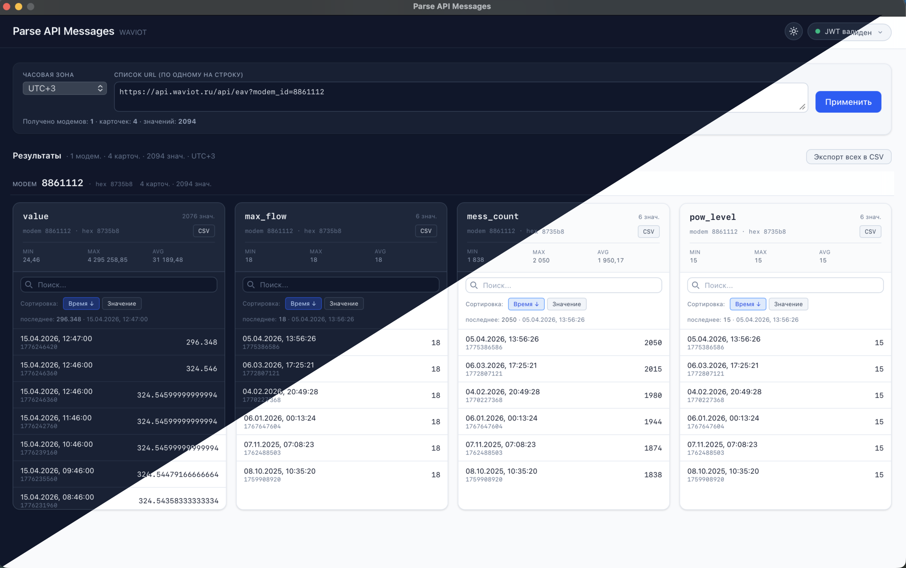

# Parse API Messages

[](https://github.com/TimurTurdyev/my-tools-parse-message-waviot/releases/latest)
[](LICENSE)
[](https://go.dev)
[](https://wails.io)
[](https://vuejs.org)
[](https://vite.dev)
[](https://tailwindcss.com)


> Персональный desktop-инструмент для быстрого просмотра и разбора сообщений API WAVIOT.

Wails-приложение (Go + Vue 3): вставляете URL вида `https://api.waviot.ru/api/eav?modem_id=...&obis_code=value`, приложение добавляет ваш `WAVIOT_JWT`-cookie, делает GET и показывает данные в виде карточек по модемам и метрикам (obis-кодам), с поиском, сортировкой, экспортом в CSV и сменой таймзоны без повторного запроса.

## Скриншот



<sub>Слева-сверху — тёмная тема, справа-снизу — светлая. Один и тот же набор данных; таблицы с модемом, 4 obis-кодами, виртуализованными списками значений и sticky-заголовком модема.</sub>

## Быстрый старт

```bash
# 1. Установите Wails CLI (версию из go.mod)
go install github.com/wailsapp/wails/v2/cmd/wails@v2.12.0

# 2. Установите зависимости фронтенда
cd frontend && npm install && cd ..

# 3. Запустите в dev-режиме
wails dev

# 4. Соберите релизную бинарку
wails build
```

## Сборка (Makefile)

Для сборки и распространения есть `Makefile` — `make` без аргументов покажет все таргеты:

```bash
make dev             # wails dev с hot reload
make mac             # нативная сборка под текущую архитектуру macOS
make mac-universal   # macOS universal binary (amd64 + arm64)
make windows         # кросс-сборка под Windows amd64
make all             # mac-universal + windows
make release         # all + упаковка в zip в build/release/
```

После `make release` в `build/release/` будут готовые zip-архивы с версией из `wails.json`:

- `parse-api-messages-<version>-darwin-universal.zip`
- `parse-api-messages-<version>-windows-amd64.zip`

### GitHub Release через CI

Для публичных релизов настроен `.github/workflows/release.yml` — GitHub Actions с матрицей `macos-latest + windows-latest`:

```bash
# поднять версию в wails.json (например 2.1.0)
git commit -am "chore: bump version to 2.1.0"
git tag v2.1.0
git push github v2.1.0
```

После пуша тега CI соберёт оба бинарника, упакует в zip и создаст GitHub Release с авто-сгенерированным changelog (из PR/коммитов). Можно также запустить вручную через Actions → `release` → `Run workflow` — тогда соберёт артефакты, но релиз не публикует.

### ⚠️ macOS: приложение не подписано

Сборка делается **без Apple Developer-подписи и без нотаризации**. Это значит:

- При первом запуске macOS покажет предупреждение вида «Не удаётся открыть *parse-api-messages*, т.к. разработчик не идентифицирован» / «не прошло проверку на наличие вредоносного ПО».
- Чтобы открыть один раз: Finder → правый клик на `.app` → **Открыть** → в диалоге снова **Открыть**. Дальше запуск обычным двойным кликом работает.
- Альтернатива: `System Settings → Privacy & Security`, прокрутить вниз до раздела «Security», там будет кнопка «Open Anyway» под именем приложения (появляется после первой попытки запуска).

Для честной подписи и распространения без предупреждений нужен платный **Apple Developer** аккаунт ($99/год) и связка `signing identity` + `notarytool`. Для персонального инструмента это избыточно — предупреждение легко обойти вручную.

### Windows: SmartScreen

При первом запуске `.exe` Windows SmartScreen может показать «Windows защитил ваш компьютер». Нажмите **Подробнее → Выполнить в любом случае**. Подписанный EV-сертификат ($300+/год) убирает предупреждение, но для личного инструмента смысла нет.

## Ключевые возможности

- **Интерактивная авторизация.** Либо одним кликом «Автопередача JWT» (приложение поднимает локальный одноразовый listener и даёт JS-снипет для консоли браузера), либо ручная вставка значения cookie `WAVIOT_JWT`.
- **Локальное хранение токена.** JWT кладётся в `os.UserConfigDir()/parse-api-messages/jwt.json` c правами `0600`, подтягивается при запуске.
- **Карточки по (модем, obis-код).** Один модем = одна группа с sticky-заголовком; одна метрика = одна карточка со статистикой (min / max / avg), поиском и сортировкой по времени или значению.
- **Большие объёмы.** Список значений в карточке виртуализован — десятки тысяч записей без просадок по FPS.
- **Мгновенная смена таймзоны.** Переключение UTC±N переформатирует уже полученные данные, без повторного HTTP-запроса.
- **Экспорт в CSV.** Одна карточка или всё сразу — в буфер обмена.
- **Светлая и тёмная темы** c переключателем в шапке, выбор сохраняется между запусками.

## Стек

- **Backend:** Go 1.22, [Wails v2.12.0](https://wails.io), `log/slog`, stdlib `net/http`
- **Frontend:** Vue 3.5, Vite 7, TailwindCSS 4
- **Сборка:** `wails build`

## Где хранится JWT

`os.UserConfigDir()/parse-api-messages/jwt.json` (права `0600`). Файл автоматически подтягивается при старте, обновляется при сохранении и удаляется через кнопку «Очистить» в UI.

## Переменные окружения

- `LOG_LEVEL` — `debug` / `info` / `warn` / `error`. По умолчанию `debug`. На проде имеет смысл ставить `info`.

## Автор и лицензия

Автор: [Timur Turdyev](https://github.com/TimurTurdyev)
Лицензия: [MIT](LICENSE) · © 2026
